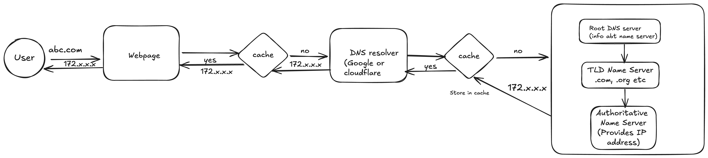

### What is DNS?
- Phonebook of internet. Converts domain names to IP address
  

### How does it work?



### Who maintains DNS servers?

1. Root DNS servers are maintained by 12 independent organizations
   Organizations like Verisign, Internet Systems Consortium (ISC), Cogent, NASA, and others maintain these root servers.  

2. TLD DNS Servers are maintained by TLD registry operators responsible for specific TLDs, such as .com, .org, .net, or country code TLDs like .uk or .ca. 
Examples of TLD registry operators include Verisign (for .com and .net), Public Interest Registry (for .org), and Nominet (for .uk). Country-code TLDs are usually managed by national authorities or organizations.

3. Authoritative name servers are maintained by the owners of the domain names. These servers contain the DNS records that provide the IP address and other relevant information for specific domains.
   
Typically, domain registrars, web hosting providers, or content delivery networks (CDNs) provide authoritative DNS services. Examples include GoDaddy, Cloudflare, AWS Route 53, and Google Cloud DNS.

4. Recursive DNS resolvers are maintained by ISPs like Comcast, AT&T, etc., for their customers or Third-party DNS providers like Google Public DNS (8.8.8.8), Cloudflare DNS (1.1.1.1), and OpenDNS.

### What Happens If a DNS Server You Use Goes Down?
If the recursive DNS server you are using goes down, your device will try to query the secondary DNS server. For example, if your primary DNS server is 8.8.8.8 (Google) and it goes down, your device will automatically use the secondary DNS server, such as 8.8.4.4.

If the authoritative DNS server for a domain is down, then queries for that domain cannot be resolved. As a result, users will be unable to access that particular domain until the server is back online or a backup server takes over.

### User-Level Solutions:
Change DNS Settings: If you find that your ISP's DNS server is down, you can change your DNS settings to use a third-party DNS provider like Google Public DNS (8.8.8.8, 8.8.4.4) or Cloudflare (1.1.1.1, 1.0.0.1) to regain internet access.

Use Local Cache: Sometimes, if the DNS server is down but the IP address is still cached locally on your device, you may be able to access the website until the cache expires.

### Tools

Use `nslookup` to get IP address of a website

```
cmd - nslookup www.google.com 8.8.8.8

Server:		8.8.8.8
Address:	8.8.8.8#53

Non-authoritative answer:
Name:	www.google.com
Address: 172.217.2.36
```

### Main types of DNS records

A Record: Maps a domain name to an IPv4 address.
AAAA Record: Maps a domain name to an IPv6 address.
CNAME Record: Maps a domain name to another domain (aliasing).
MX Record: Specifies the mail servers for a domain.
NS Record: Lists the authoritative name servers for a domain.
TXT Record: Holds text information, often used for verification (e.g., SPF).
PTR Record: Used for reverse DNS, mapping an IP address to a domain name.