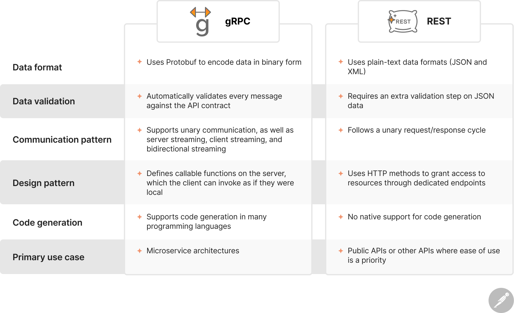

### What is gRPC?

- Remote Procedure Call Open source framework created by Google in 2016
- Helps to call function in another process like microservices within same or
  different data centres
- Uses Protobuf as data interchange format
- Supports JSON as well if required

### How to use

1. Define a service in `.proto` file
2. Generate server and client code using `Protobuf` compiler
3. Create the server application, implementing the generated service interfaces and spawning the gRPC server
4. Create the client application, making RPC calls using generated stubs

A service file may look like this:

```
syntax = "proto3";

package sum;

service Calculator {
  rpc Add (AddRequest) returns (AddResponse);
}

message AddReq {
  int32 num1 = 1;
  int32 num2 = 2;
}

message AddResponse {
  int32 result = 1;
}

```

### gRPC vs REST



#### Similarities

- **Client/server architecture** - Both gRPC and REST follow client server architecture
- **Use of HTTP** - gRPC uses HTTP/2 and REST uses HTTP/1.1
- **Language Agnostic** - gRPC and REST are both language agnostic
- **Stateless** - Both technologies are stateless 

### Credits
https://blog.postman.com/grpc-vs-rest/
https://medium.com/@coderviewer/simple-usage-of-grpc-with-python-f714d9f69daa