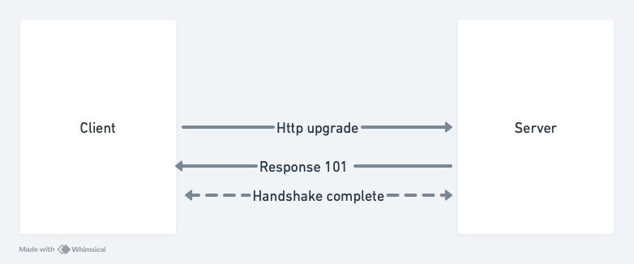

## Websockets

### What is Websocket?

- Bidirectional full duplex persistent connection between client and server  
- Keeps connection open to transfer information back and forth
- Useful for real time communication like chat application, multi player games

### Alternative to Websocket

1. Polling - Poll for data continuously
2. Long term polling - Poll and wait for data and then close connection
3. Server Sent Event(SSE) -> Unidirectly where only server needs to send data to client

### How to create websockets?

### References

https://www.youtube.com/watch?v=favi7avxIag
